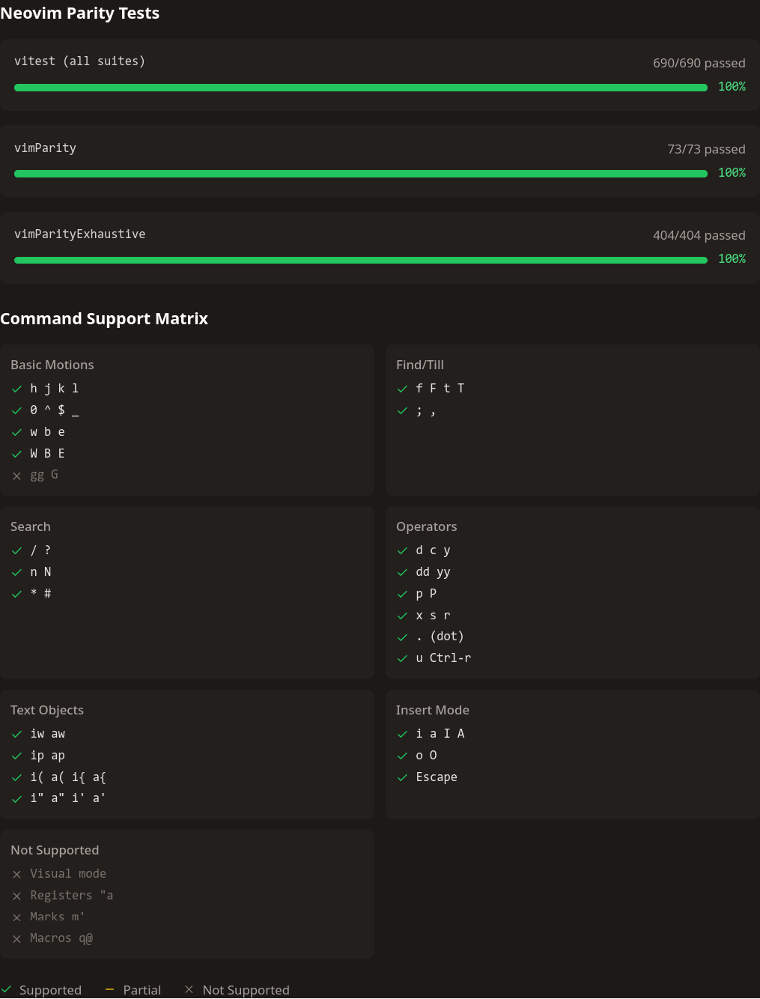

# Vimprove

一个交互式 Vim 学习网站，通过浏览器中的"迷你 Vim 编辑器 + 关卡式练习"帮助用户掌握 Vim 命令。

## ✨ 功能特性

- **纯函数 Vim 引擎** - 零依赖的 Vim 命令解析器，所有状态更新通过 reducer 管理
- **关卡式学习** - 循序渐进的课程设计，从基础移动到高级编辑
- **实时反馈** - 即时验证目标完成情况，可视化编辑器状态
- **可播放示例** - Run Example 功能展示命令执行过程
- **进度追踪** - 本地存储学习进度，记录完成时间和尝试次数

## 🎯 Vim编辑器功能实现



## 🚀 快速开始

```bash
# 安装依赖
npm install

# 启动开发服务器
npm run dev

# 构建生产版本
npm run build

# 预览构建结果
npm run preview

# 代码检查
npm run lint

# 运行测试
npm test

# 测试 UI 界面
npm run test:ui

# 生成测试覆盖率
npm run test:coverage

# 运行对拍测试 - 基本功能
npm run test -- src/core/vimParity.test.ts

# 运行对拍测试 - 详尽测试
npm run test -- src/core/vimParityExhaustive.test.ts
```

访问 `http://localhost:3000` 开始学习。

## 🛠️ 技术栈

- **React 19** - UI 框架
- **TypeScript** - 类型安全
- **Vite** - 构建工具
- **Tailwind CSS 3** - 样式方案
- **React Router** - 路由管理
- **React Markdown** - Markdown 渲染

## 📁 项目结构

```
src/
├── core/              # Vim 引擎核心（纯逻辑，零依赖）
│   ├── types.ts      # 类型定义
│   ├── vimReducer.ts # 状态管理 reducer
│   ├── motions.ts    # 移动逻辑
│   ├── operators.ts  # 操作符逻辑
│   └── utils.ts      # 工具函数
│
├── data/              # 课程数据
│   ├── categories.ts # 课程分类
│   └── lessons/      # 课程文件（按章节组织）
│       ├── chapter1/ # 模式与基础移动（4 课）
│       ├── chapter2/ # 单词移动与小编辑（5 课）
│       ├── chapter3/ # 高级编辑（5 课）
│       ├── chapter4/ # 行内查找与精确编辑（4 课）
│       ├── chapter5/ # 文本对象（5 课）
│       └── chapter6/ # 搜索与重构（4 课）
│
├── hooks/             # 自定义 hooks
│   ├── useVimEngine.ts    # Vim 引擎封装
│   ├── useChallenge.ts    # 挑战逻辑
│   └── useProgress.ts     # 进度持久化
│
├── components/        # UI 组件
│   ├── common/       # 通用组件
│   ├── lesson/       # 课程组件
│   ├── challenge/    # 挑战组件
│   ├── example/      # 示例播放器
│   └── layout/       # 布局组件
│
└── pages/            # 页面组件
```

## 🧪 测试

- 测试框架：Vitest（`npm run test -- <file>` 可按文件执行）
- 覆盖范围：
  - `src/core/motions.test.ts` - 基础/单词/行内/查找移动
  - `src/core/operators.test.ts` - d/c/y + motion、文本对象
  - `src/core/vimReducer.test.ts` - 模式切换、编辑、undo/redo
  - `src/core/dot-command.test.ts` - `.` 重放
  - `src/core/vimParity.test.ts` - 与 Neovim 对拍测试
  - `vimParityExhaustive.test.ts` - 与 Neovim 对拍测试（详尽）

## 📝 CHANGELOG

### Release v1.5.0
- 🧪 Vim 引擎对拍：`.` 重播（cw/paste/末行 jw）、多行寄存器行粘贴、撤销快照去重与 cw 边界全面对齐 Neovim
- ⌨️ 可视化提升：按键历史面板 + Vim Status 面板，组合键聚合、实时记录与 dot 重播提示一致
- 🌏 输入与体验：Insert 模式中文输入可用，Tooltip 抖动修复，课程切换重新挂载消除键位提示重复
- 🎯 学习流优化：挑战目标与示例文案更清晰（助记/拼写练习），Run Example/课程示例节奏更平滑

### Release v1.0.0
- 🎉 首个正式版本，实现主要功能
- ✨ 新增设置面板「Vim 状态」和「练习场」标签页（支持 C++/JS/Python 语法高亮，展示 Neovim 对拍测试结果）
- 🐛 修复 Insert 模式光标位置和挑战切换状态重置等核心 bug
- 💾 改进学习体验：记住上次学习位置，支持 Enter 快速进入下一课

<details>
<summary><b>点击展开Alpha版本历史</b></summary>

### v1.5.1
- 🐛 Fix replace-wait state: `ru` writes literal `u` instead of triggering undo, matching Vim behavior
- 🧭 Word motion细化：`w` 从标点起跳会先停在 `/` 等分隔符，不再直接跳到下一个单词
- ✅ Parity 覆盖：vimParity 补充上述场景用例，保持 Neovim 行为一致

### v1.4.3
- 🐛 `.` 重播对齐 Vim：cw 光标、末行 jw 落点、paste 重播行为与对拍一致
- 📋 粘贴寄存器修正：多行寄存器按行插入，`P` 粘贴前光标与 Neovim 一致
- 🧭 课程切换重新挂载 lesson 视图，消除键位提示重复字符
- ♻️ 撤销快照去重、插入退出立即落盘，undo/redo 与 Neovim 行为保持一致

### v1.4.2
- 🌏 支持中文输入：Insert 模式正常输入中文，Normal 模式不响应但在按键历史中显示
- 🐛 修复 undo/redo 命令按键历史闪烁问题（清除所有 pending 状态）
- 🎨 修复 Tooltip 位置闪烁：固定向上显示，避免自动方向切换

### v1.4.1
- 🎨 自定义Tooltip组件：按键历史使用本站风格UI，组合键聚合显示所有子成员信息
- 🔁 `.`命令增强：tooltip中显示被重放的具体动作序列（如 `→ cw`）
- 🐛 修复count+motion组合键记录：`3w`等命令正确归为一组而非分开显示

### v1.4.0
- ⌨️ 新增按键历史面板：动画示例和挑战编辑器右侧实时显示所有按键记录
- 🎯 智能组合键分组：operator+motion、Insert+text、find+char 等自动归组，显示等待状态
- ⚡ 按键记录零延迟：同步计算状态并记录，消除 React 渲染周期延迟
- 🔄 改进播放控制：上一步功能正确重建按键历史，重置按钮移至右上角

### v1.2.0
- 📝 课程体验优化：明确挑战目标描述（1.2 课 TARGET 首字母）、添加命令英文助记（w/b/e/s/r）、改进拼写练习示例（更明显的 cXrrent/vXlue）
- 🎬 动画示例改进：2.3 课 w vs W 对比从双光标赛跑改为单光标渐进演示，学习曲线更平缓

### v1.1.0
- ✅ Undo/Redo 与快照对齐 Neovim：插入录制结束即刻落盘快照，`u`/`<C-r>` 基于索引切换并保留 lastChange，恢复光标行为贴合 Vim
- 🧮 可重复操作修复：`iZ`/`aY`、`x` 等组合在 `.` 重放和 redo 后保持光标与寄存器一致，`dd` 删除后保留列位置
- ✂️ 标点 `cw` 范围与移动边界修正：仅修改当前标点段，`w` 在文件末尾落在最后字符
- 🧪 Neovim 对拍：`vimParityExhaustive.test.ts` 全量通过

### v0.15.0
- 🔧 修复 Insert 模式核心问题：引入 `insertCol` 分离光标显示与插入位置，修复 c$/cw/Escape 等命令行为
- ✅ 建立 Neovim 对拍测试系统：headless 模式对比真实 Vim，生成全面组合测试（序列长度 1-3，覆盖所有已实现功能）
- 📊 大幅提升测试通过率：从 72% (291/404) 提升到 79% (319/404)
- 🐛 修复 d$ 等操作符边界情况 bug

### v0.14.0
- 🧩 英文课程文案全部迁移到 `en/lessons.json`，页面不再依赖 defaultValue，彻底消除 TRANSLATION MISSING
- ✅ 新增 i18n 结构与完整性测试：校验所有 locale 的 lessons/namespace 键类型一致、覆盖全部分类与课程序号
- 🔧 修复中文版/活泼版课程翻译结构缺失（tracks/steps/keys/goals 对齐），确保 Run Example 与 Challenge 文案正常显示

### v0.13.0
- 🎨 移动端 Header 重设计：Logo/标题左对齐，新增语言切换按钮，所有按钮右侧均匀排布（上一课、下一课、语言、设置、侧栏、GitHub）
- 📱 移动端设置面板优化：紧凑布局（95vw 宽度 + 3列字体选项 + 简化预览代码），移除标题栏和关闭按钮
- 🔧 修复 UI 问题：字号滑块居中对齐（webkit + moz），课程切换自动滚动到顶部（跨浏览器兼容）

### v0.12.0
- 📱 全面移动端响应式优化：实现智能侧边栏（移动端可切换，桌面端自动展开），汉堡菜单按钮集成，遮罩层点击关闭
- 🎨 智能 Header 设计：移动端顶栏集成 Logo、菜单、导航与操作按钮，滚动向下自动隐藏，向上滚动重新出现，节省屏幕空间
- 🗂️ 侧边栏空间优化：移动端隐藏侧边栏顶部 Logo 和标题以节省纵向空间，桌面端保留完整品牌展示
- 📐 响应式细节优化：浮动按钮移动端集成到顶栏（桌面端保持右下角），VimChallenge 编辑器高度适配（移动端 500px，桌面端 600px），内容边距优化
- 🔧 完善 i18n 支持：新增 menu、prevLesson、nextLesson 翻译键（英文和中文）

### v0.11.0
- 🧭 新增课程导航与 GitHub 链接：右下角悬浮按钮支持上一课/下一课快速跳转，添加 GitHub Star 按钮（支持 i18n）
- 💾 实现学习进度记忆：首次点击"开始学习"后自动记住状态，之后访问直接进入课程页，点击"首页"可重置
- 🎨 全面优化 UI 体验：消除白屏闪烁（深色加载动画），紧凑侧边栏布局，语言切换器改用短标签（Eng/中/活），悬浮按钮样式优化（更亮背景+边框）
- 🐛 修复课程内容显示问题：RunExample 切换课程黑屏、中文/活泼版 lessons.json 索引错位（补全"示例"翻译并重排内容索引）

### v0.10.1
- 🎨 优化设置面板布局：Tab 栏从左侧改为顶部，面板尺寸增大以适应更长的代码预览
- 🔤 实现字体按需加载系统：Google Fonts 动态加载，系统字体自动 fallback
- 📝 更新字体列表：新增 10 个等宽字体选项（Consolas、Fira Code、JetBrains Mono、Cascadia Code 等）
- 🐛 修复外观设置预览代码缩进不显示的问题（添加 `whitespace-pre`）
- 🌐 修复首页按钮缺少 i18n 支持
- 🗣️ 简化语言菜单显示（移除括号中的语言说明）

### v0.10.0
- 🗣️ 新增「中文（活泼）」 i18n 方案：为课程文案提供更具故事感和引导感的中文活泼版
- 📚 为 Chapter 1–6 撰写活泼版课程文案（zh-lively/lessons.json），按章节覆盖 modes/motions、word/WORD、小编辑、操作符、文本对象、find/till、搜索重构等内容
- 🧠 形成统一的活泼版文案规范（tmp/plans/zh-lively.md），包括语气风格、术语处理、情绪价值与教学结构

### v0.9.0
- 🌐 引入 i18next + react-i18next，支持多语言（英文/中文）与语言检测、切换器
- 🧭 全站文案 i18n 化：布局、首页、课程页、挑战/Run Example/设置面板均接入翻译
- 📚 课程内容支持翻译键：章节标题、课程标题/简介、Markdown、示例步骤、挑战目标均可多语言
- 🐛 修复 Run Example 在未初始化回调时的运行时错误（黑屏问题）

### v0.8.0
- ✨ 新增设置面板系统：支持自定义编辑器字体和字号（默认 Consolas 16px）
- 🎨 重构编辑器排版：应用业界标准配置（CSS 变量、动态样式更新）
- 🖼️ 细节样式优化

### v0.7.1
- 🎨 改进编辑器排版：应用业界标准样式配置（14px 字号、1.5 行高、flex 布局）
- 🔧 统一 VimChallenge 和 RunExamplePlayer 编辑器样式

### v0.7.0
- 🧹 核心 Vim 引擎重构：抽离历史/录制/粘贴公共工具，拆分 reducer 逻辑，降低重复和边界处理复杂度

### v0.6.0
- ✨ 新增 Chapter 4-6 课程：find/till 精准编辑、文本对象、搜索/重构关卡
- 🔍 实现搜索能力 `/ ? n N * #`，支持重复匹配跳转
- 🧩 新增文本对象 `iw/aw/ip/ap/()`/`{}`/`[]`/`""`，可与 d/c/y 组合
- 🧪 添加文本对象与搜索路径的单元测试

### v0.5.1
- 🐛 修复 `.` 重放在 `cw`/`c$`/粘贴/计数覆盖等场景的边界问题，点命令测试全绿
- 🔄 优化 Undo/Redo 历史记录，确保重做正确恢复最新变更
- 🧭 调整 `w`/`e` 动作与寄存器行为，末尾空格处理更贴近预期
- ✅ 176/176 单元测试全面通过

### v0.5.0
- ✅ 建立完整的单元测试系统（Vitest）
- 📊 176 个测试用例，覆盖所有 Vim 引擎核心功能
- 🧪 测试覆盖：motions、operators、vimReducer、dot-command
- 📈 86%+ 通过率，核心功能 100% 验证

### v0.4.0
- ✨ 新增 `.` 命令 - 重复上次修改操作
- 🏗️ 重构 VimState，新增按键记录机制
- 📚 支持 count prefix 覆盖（如 `3x` 后可用 `2.` 覆盖）

### v0.3.0
- ✨ 新增 Chapter 3 - 高级编辑课程
- ✨ 实现 Undo/Redo 系统（`u`, `Ctrl-r`）
- ✨ 实现 Yank/Paste 功能（`y`, `p`, `P`）
- ✨ 支持数字前缀（`3w`, `5dd` 等）
- ✨ 实现字符查找（`f`, `F`, `t`, `T`, `;`, `,`）

### v0.2.0
- ✨ 新增 Chapter 1-2 课程
- ✨ 实现 Run Example 可播放示例功能
- ✨ 支持 Markdown 渲染
- 🎨 完善 UI 样式和交互

### v0.1.0
- 🎉 项目初始化
- 🏗️ 模块化架构搭建
- 🔧 基础 Vim 引擎实现
- 📦 课程系统框架

</details>

---

**当前版本**: v1.4.1
